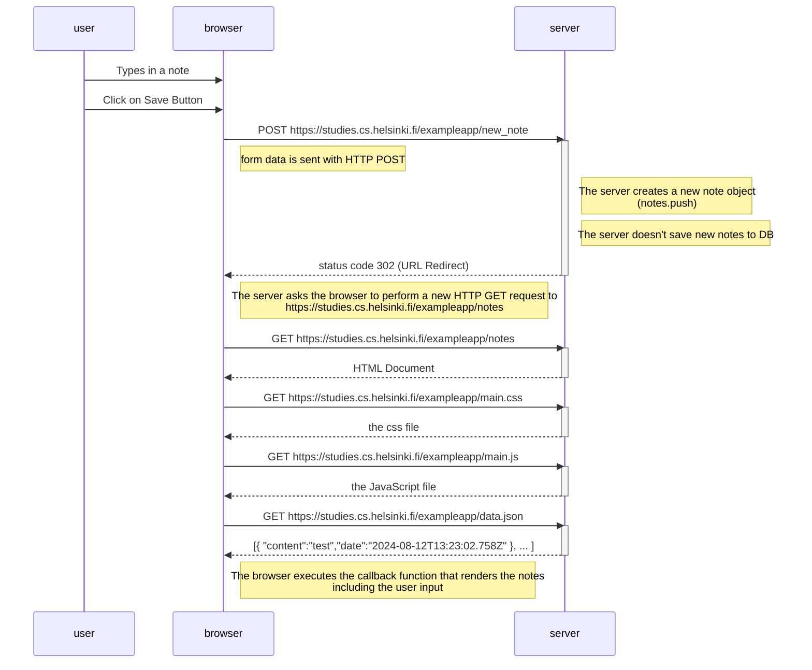

```mermaid
   
sequenceDiagram
    participant user
    participant browser
    participant server

    user->>browser: Types in a note
    user->>browser: Click on Save Button

    browser->>server: POST https://studies.cs.helsinki.fi/exampleapp/new_note
    activate server
    Note right of browser: form data is sent with HTTP POST
    Note right of server: The server creates a new note object<br>(notes.push)
    Note right of server: The server doesn't save new notes to DB
    server-->>browser: status code 302 (URL Redirect)
    deactivate server
    Note right of browser: The server asks the browser to perform a new HTTP GET request to<br> https://studies.cs.helsinki.fi/exampleapp/notes

    browser->>server: GET https://studies.cs.helsinki.fi/exampleapp/notes
    activate server
    server-->>browser: HTML Document
    deactivate server

    browser->>server: GET https://studies.cs.helsinki.fi/exampleapp/main.css
    activate server
    server-->>browser: the css file
    deactivate server

    browser->>server: GET https://studies.cs.helsinki.fi/exampleapp/main.js
    activate server
    server-->>browser: the JavaScript file
    deactivate server

    browser->>server: GET https://studies.cs.helsinki.fi/exampleapp/data.json
    activate server
    server-->>browser: [{ "content":"test","date":"2024-08-12T13:23:02.758Z" }, ... ]
    deactivate server
    Note right of browser: The browser executes the callback function that renders the notes <br>including the user input;


```