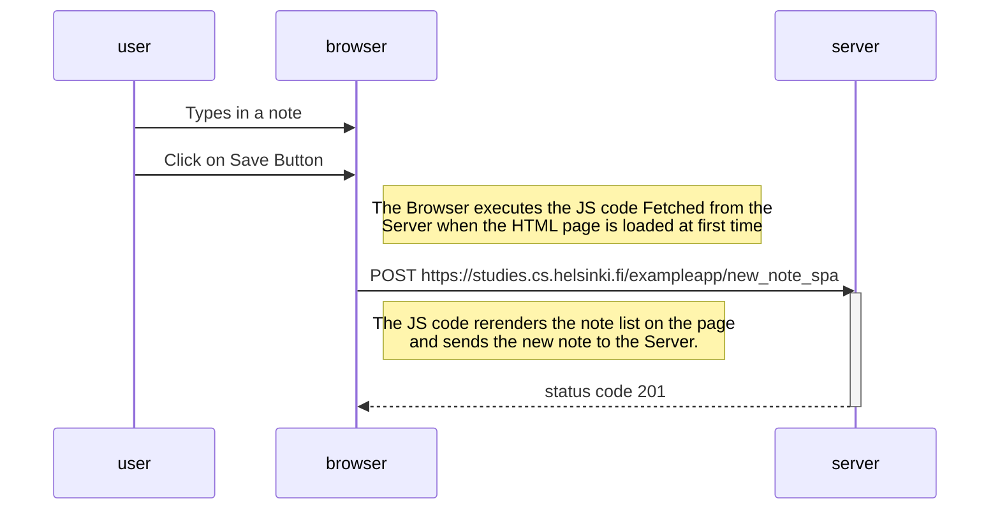

```mermaid
   
sequenceDiagram
    participant user
    participant browser
    participant server

    user->>browser: Types in a note
    user->>browser: Click on Save Button

    Note right of browser:The Browser executes the JS code Fetched from the <br>Server when the HTML page is loaded at first time

    browser->>server: POST https://studies.cs.helsinki.fi/exampleapp/new_note_spa
    activate server
    Note right of browser :The JS code rerenders the note list on the page <br> and sends the new note to the Server.
   
    server-->>browser: status code 201
    deactivate server

    


```